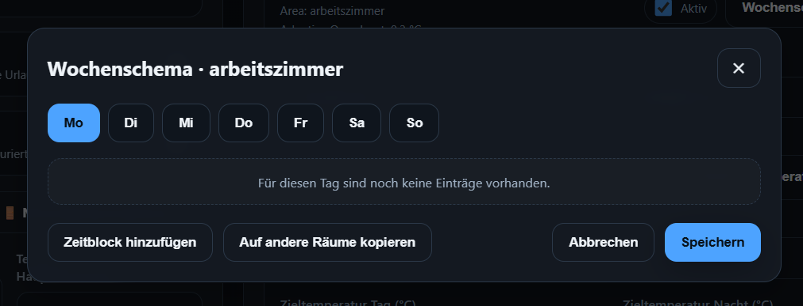

<h1>

Smartdome Heat Control
</h1>

Smartdome Heat Control is an advanced **multi-room heating controller for Home Assistant**.

It works in two ways — with or without a central heating system:

| Setup | Description |
|---|---|
| **With main thermostat** | Smartdome activates your central heating system when one or more rooms need heat, and shuts it off when no room needs heat anymore. |
| **Without main thermostat** | Smartdome controls only the individual radiator thermostats per room. No central heating system required. |

> **Important:** The main thermostat is only used to switch the heating system on or off. All room-level control (temperatures, schedules, modes) works the same regardless of whether a main thermostat is configured.

---

# How It Works

Each room is monitored individually using a temperature sensor and a radiator thermostat.

1. Smartdome compares the current room temperature against the target temperature.
2. If a room needs heat:
   - the **radiator thermostat opens**
   - the **main thermostat activates the heating system** *(if configured)*
3. Once the target temperature is reached:
   - the **radiator thermostat closes**
   - if no other room needs heat, the **main thermostat shuts the system down** *(if configured)*

---

# Features

### Smart Room Heating

Each room can be configured individually with:

- Radiator thermostat
- Temperature sensor
- Day and night target temperatures
- Day/night schedule or weekly schedule
- Window contact sensor
- Away temperature
- Enable/disable per room

---

### Weekly Schedule

Each room supports a fully customizable weekly schedule.

You can define different time slots for every day of the week, each with its own target temperature. This allows precise control over when a room heats up — for example warmer in the morning and evening, cooler during the day.

---

### Window Open Detection

When a window sensor detects an open window:

- Heating in that room is paused automatically
- The radiator thermostat is set to minimum temperature
- Heating resumes automatically once the window is closed

A configurable delay prevents the system from reacting to very short ventilation.

---

### Vacation Mode

Reduces heating across all rooms for longer absences.

Entities:

    switch.smartdome_heat_control_vacation_mode
    number.smartdome_heat_control_vacation_temperature

---

### Away Mode

Reduces heating to each room's configured away temperature for short absences.

Entity:

    switch.smartdome_heat_control_away_mode

---

### Heating Modes

A global heating strategy controls how the system behaves when rooms reach their target temperature.

| Mode | Description |
|---|---|
| **Comfort** | Radiator valves stay open longer — reduces temperature fluctuations, prioritizes comfort. |
| **Balanced** *(default)* | Recommended standard mode — good balance between comfort and energy efficiency. |
| **Energy** | Valves close earlier to reduce overheating — prioritizes energy saving. |
| **Adaptive** | Smartdome learns how each room behaves and automatically compensates for temperature overshoot. |

Entity:

    select.smartdome_heat_control_heating_mode

---

### Adaptive Learning

In Adaptive mode, Smartdome measures how much a room overshoots its target temperature after a heating cycle and automatically adjusts future behavior.

Smartdome uses **three separate learning buckets** based on heating cycle duration:

| Bucket | Duration | Default overshoot |
|---|---|---|
| Short | < 15 min | 0.2 °C |
| Medium | 15 – 45 min | 0.4 °C |
| Long | > 45 min | 0.7 °C |

Example:

    Target temperature:  21.0 °C
    Actual peak:         21.5 °C
    Learned overshoot:    0.5 °C (medium bucket)
    → Next cycle: heating stops 0.5 °C earlier

Learned values are persisted across Home Assistant restarts.

---

### Heating Circuits

For buildings with **multiple independent heating circuits** (e.g. underfloor + radiators, or different floors), each circuit can be configured with its own main thermostat and sensor.

| Setup | Description |
|---|---|
| **No circuits configured** | Works exactly as before — one global main thermostat for all rooms. |
| **Circuits configured** | Each circuit has its own main thermostat. Rooms are assigned to circuits and grouped accordingly in the UI. |

> Circuits are only needed if the building has multiple physically separate heating systems. For most homes, no circuits need to be configured.

---

# Dashboard

### Main Interface

The main dashboard shows all rooms and global settings at a glance.

---

### Global Settings

Configure:

- Main thermostat *(optional)*
- Main temperature sensor *(optional)*
- Boost delta
- Temperature tolerance
- Global day/night times
- Heating mode
- Vacation and away mode
- Heating circuits *(optional — only for multi-circuit buildings)*

---

### Room Configuration

Configure each room individually:

- Thermostat, sensor, window sensor
- Day/night target temperatures
- Away temperature
- Day/night schedule or weekly schedule
- Thermostat control profile
- Heating circuit assignment *(optional)*
- Enable/disable

---

# Installation

### HACS (Recommended)

1. Open **HACS**
2. Go to **Integrations**
3. Click **Custom repositories**
4. Add this repository URL:

       https://github.com/19DMO89/smartdome_heat_control

   Category: `Integration`

5. Install **Smartdome Heat Control**
6. Restart Home Assistant

---

# Configuration

After installation:

    Settings → Devices & Services → Add Integration → Smartdome Heat Control

The setup asks for:

- **Main thermostat** *(optional — only needed if you have a central heating system)*
- **Main temperature sensor** *(optional)*

Rooms can then be discovered automatically from your Home Assistant areas, or added and configured manually in the dashboard.

---

# Home Assistant Entities

### Switches

    switch.smartdome_heat_control_enabled
    switch.smartdome_heat_control_away_mode
    switch.smartdome_heat_control_vacation_mode

### Numbers

    number.smartdome_heat_control_vacation_temperature

### Selects

    select.smartdome_heat_control_heating_mode

### State Entity

    smartdome_heat_control.config

---

---

<h1>

Smartdome Heat Control (Deutsch)
</h1>

Smartdome Heat Control ist eine **intelligente Mehrraum-Heizungssteuerung für Home Assistant**.

Die Integration funktioniert auf zwei Arten — mit oder ohne zentrale Heizungsanlage:

| Setup | Beschreibung |
|---|---|
| **Mit Hauptthermostat** | Smartdome aktiviert die Heizungsanlage, wenn ein oder mehrere Räume Wärme benötigen, und schaltet sie ab, wenn kein Raum mehr Wärme braucht. |
| **Ohne Hauptthermostat** | Smartdome steuert nur die einzelnen Heizkörperthermostate je Raum. Keine zentrale Heizungsanlage notwendig. |

> **Wichtig:** Das Hauptthermostat dient ausschließlich dazu, die Heizungsanlage ein- oder auszuschalten. Die gesamte Raumsteuerung (Temperaturen, Zeitpläne, Modi) funktioniert unabhängig davon, ob ein Hauptthermostat konfiguriert ist oder nicht.

---

# Funktionsweise

Jeder Raum wird individuell über einen Temperatursensor und ein Heizkörperthermostat überwacht.

1. Smartdome vergleicht die aktuelle Raumtemperatur mit der Zieltemperatur.
2. Wenn ein Raum Wärme benötigt:
   - öffnet das **Heizkörperthermostat**
   - aktiviert das **Hauptthermostat die Heizungsanlage** *(falls konfiguriert)*
3. Sobald die Zieltemperatur erreicht ist:
   - schließt das **Heizkörperthermostat**
   - schaltet das **Hauptthermostat die Anlage ab**, wenn kein Raum mehr heizt *(falls konfiguriert)*

---

# Funktionen

### Raumsteuerung

Jeder Raum kann individuell konfiguriert werden mit:

- Heizkörperthermostat
- Temperatursensor
- Tag- und Nacht-Zieltemperaturen
- Tag/Nacht-Zeitplan oder Wochenschema
- Fensterkontaktsensor
- Abwesenheitstemperatur
- Aktivieren/Deaktivieren pro Raum

---

### Wochenschema

Jeder Raum unterstützt ein frei konfigurierbares Wochenschema.

Für jeden Wochentag können individuelle Zeitslots mit eigener Zieltemperatur definiert werden. So lässt sich zum Beispiel morgens und abends wärmer heizen und tagsüber kühler halten.

---

### Fenster-Erkennung

Wenn ein Fensterkontakt ein geöffnetes Fenster meldet:

- Wird die Heizung in diesem Raum automatisch pausiert
- Das Thermostat wird auf Mindesttemperatur abgesenkt
- Nach dem Schließen des Fensters wird die Heizung automatisch wieder aufgenommen

Eine konfigurierbare Verzögerung verhindert, dass das System auf kurzes Lüften reagiert.

---

### Urlaubsmodus

Senkt die Heizung aller Räume für längere Abwesenheiten ab.

Entitäten:

    switch.smartdome_heat_control_vacation_mode
    number.smartdome_heat_control_vacation_temperature

---

### Abwesenheitsmodus

Senkt die Heizung auf die je Raum konfigurierte Abwesenheitstemperatur — gedacht für kurze Abwesenheiten.

Entität:

    switch.smartdome_heat_control_away_mode

---

### Heizmodi

Eine globale Heisstrategie bestimmt, wie das System reagiert wenn Räume ihre Zieltemperatur erreichen.

| Modus | Beschreibung |
|---|---|
| **Comfort** | Heizkörperventile bleiben länger offen — weniger Temperaturschwankungen, Komfort im Vordergrund. |
| **Balanced** *(Standard)* | Empfohlener Standardmodus — gute Balance zwischen Komfort und Energieeffizienz. |
| **Energy** | Ventile schließen früher um Überhitzen zu vermeiden — Energiesparen im Vordergrund. |
| **Adaptive** | Smartdome lernt das Verhalten jedes Raumes und kompensiert automatisch Temperatur-Überschwingen. |

Entität:

    select.smartdome_heat_control_heating_mode

---

### Adaptives Lernen

Im Adaptive-Modus misst Smartdome, wie stark ein Raum nach einem Heizzyklus über die Zieltemperatur hinausschießt, und passt das zukünftige Verhalten automatisch an.

Smartdome verwendet **drei separate Lern-Buckets** basierend auf der Heizzyklusdauer:

| Bucket | Dauer | Standard-Überschwingen |
|---|---|---|
| Kurz | < 15 Min | 0,2 °C |
| Mittel | 15 – 45 Min | 0,4 °C |
| Lang | > 45 Min | 0,7 °C |

Beispiel:

    Zieltemperatur:          21,0 °C
    Tatsächlicher Peak:      21,5 °C
    Gelerntes Überschwingen:  0,5 °C (Mittel-Bucket)
    → Nächster Zyklus: Heizung stoppt 0,5 °C früher

Gelernte Werte bleiben über Home Assistant-Neustarts hinweg erhalten.

---

### Heizkreise

Für Gebäude mit **mehreren unabhängigen Heizkreisen** (z.B. Fußbodenheizung + Heizkörper oder verschiedene Etagen) kann jeder Heizkreis mit eigenem Hauptthermostat und Sensor konfiguriert werden.

| Setup | Beschreibung |
|---|---|
| **Keine Heizkreise konfiguriert** | Funktioniert wie bisher — ein globales Hauptthermostat für alle Räume. |
| **Heizkreise konfiguriert** | Jeder Kreis hat sein eigenes Hauptthermostat. Räume werden Kreisen zugewiesen und im Dashboard entsprechend gruppiert angezeigt. |

> Heizkreise werden nur benötigt, wenn das Gebäude mehrere physisch getrennte Heizsysteme besitzt. In den meisten Häusern ist keine Konfiguration von Heizkreisen erforderlich.

---

# Dashboard

### Hauptansicht

Das Dashboard zeigt alle Räume und globale Einstellungen auf einen Blick.

---

### Globale Einstellungen

Konfigurierbar:

- Hauptthermostat *(optional)*
- Haupttemperatursensor *(optional)*
- Boost-Delta
- Temperaturtoleranz
- Globale Tag/Nacht-Zeiten
- Heizmodus
- Urlaubs- und Abwesenheitsmodus
- Heizkreise *(optional — nur für Mehrkreis-Gebäude)*

---

### Raumkonfiguration

Jeden Raum einzeln konfigurieren:

- Thermostat, Sensor, Fensterkontakt
- Tag/Nacht-Zieltemperaturen
- Abwesenheitstemperatur
- Tag/Nacht-Zeitplan oder Wochenschema
- Thermostat-Regelprofil
- Heizkreis-Zuweisung *(optional)*
- Aktivieren/Deaktivieren

---

# Installation

### HACS (Empfohlen)

1. **HACS** öffnen
2. **Integrationen** auswählen
3. **Benutzerdefinierte Repositories** klicken
4. Repository-URL hinzufügen:

       https://github.com/19DMO89/smartdome_heat_control

   Kategorie: `Integration`

5. **Smartdome Heat Control** installieren
6. Home Assistant neu starten

---

# Konfiguration

Nach der Installation:

    Einstellungen → Geräte & Dienste → Integration hinzufügen → Smartdome Heat Control

Der Einrichtungsassistent fragt nach:

- **Hauptthermostat** *(optional — nur nötig wenn eine zentrale Heizungsanlage vorhanden ist)*
- **Haupttemperatursensor** *(optional)*

Räume können anschließend automatisch aus den Home Assistant Areas erkannt oder manuell im Dashboard angelegt und konfiguriert werden.

---

# Lizenz

MIT License
