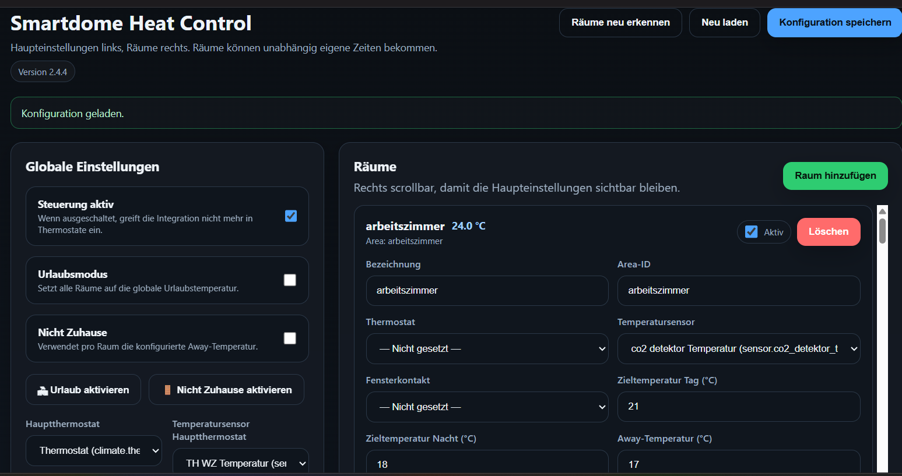
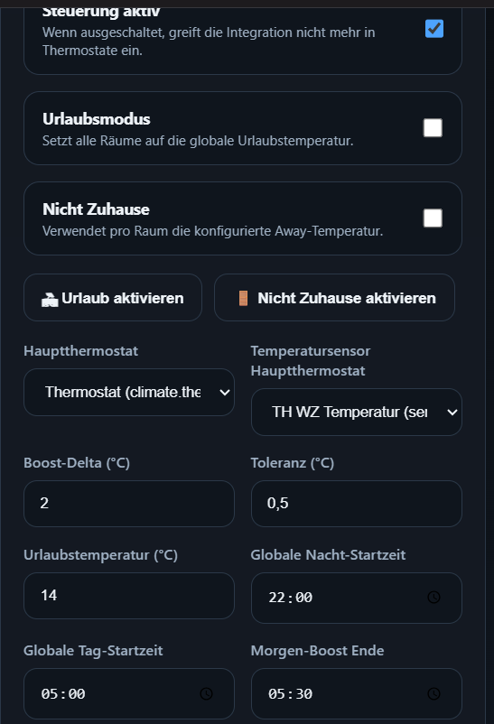
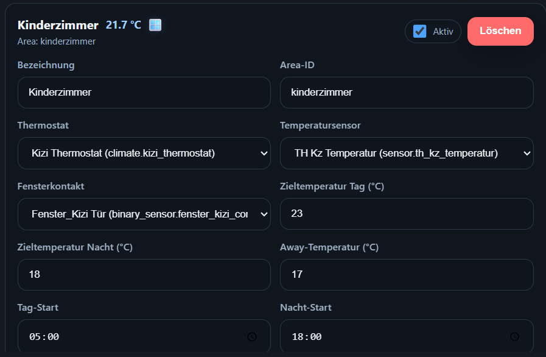

<h1>

Smartdome Heat Control
</h1>

[](https://hacs.xyz)\
[](https://home-assistant.io)\
[](LICENSE)

Smartdome Heat Control is an advanced **multi‑room heating controller
for Home Assistant** designed for heating systems that use:

-   **one main thermostat controlling the heating system**
-   **multiple radiator thermostats controlling individual rooms**

The integration coordinates the main thermostat and room thermostats to
distribute heat efficiently across your home.

Instead of letting thermostats operate independently, Smartdome ensures
the heating system produces heat **only when a room actually needs it**.

------------------------------------------------------------------------

# How It Works

Smartdome uses a **central heating logic**.

1.  Each room measures its temperature using a sensor.
2.  If a room needs heat:
    -   the **room thermostat opens the radiator**
    -   the **main thermostat boosts the heating system**
3.  When the room reaches its target temperature:
    -   the radiator thermostat closes again

Example:

    Living room too cold
    → radiator thermostat opens
    → main thermostat boosts heating

    Bathroom already warm
    → radiator thermostat closes
    → no additional heating needed

------------------------------------------------------------------------

# Features

### Smart Room Heating

Each room can have its own:

-   radiator thermostat
-   temperature sensor
-   day/night schedule
-   window contact sensor
-   away temperature

------------------------------------------------------------------------

### Window Open Detection

If a window in a room is opened:

-   heating in that room pauses automatically
-   the thermostat is lowered to minimum temperature
-   heating resumes automatically when the window closes

A delay prevents the system from reacting to short ventilation.

------------------------------------------------------------------------

### Vacation Mode

Vacation mode lowers heating for longer absences.

Entities:

    switch.smartdome_heat_control_vacation_mode
    number.smartdome_heat_control_vacation_temperature

------------------------------------------------------------------------

### Away Mode

Away mode is designed for short absences.

Entity:

    switch.smartdome_heat_control_away_mode

------------------------------------------------------------------------

# Dashboard

## Main Interface



The main dashboard provides an overview of all heating settings and
rooms.

------------------------------------------------------------------------

## Global Settings



Global settings allow configuring:

-   main thermostat
-   boost delta
-   temperature tolerance
-   day/night times
-   controller enable/disable

------------------------------------------------------------------------

## Room Configuration



Each room can be configured individually with:

-   thermostat
-   temperature sensor
-   window sensor
-   day/night temperatures
-   schedules
-   enabled state

------------------------------------------------------------------------

# Installation

### HACS (Recommended)

1.  Open **HACS**
2.  Go to **Integrations**
3.  Click **Custom repositories**
4.  Add this repository:

```{=html}
<!-- -->
```
    https://github.com/19DMO89/smartdome_heat_control

Category:

    Integration

5.  Install **Smartdome Heat Control**
6.  Restart Home Assistant

------------------------------------------------------------------------

# Configuration

After installation:

Settings → Devices & Services → Add Integration

Search for:

    Smartdome Heat Control

Setup requires:

-   main thermostat
-   optional main temperature sensor

Rooms can then be discovered automatically or configured manually.

------------------------------------------------------------------------

# Home Assistant Entities

### Switches

    switch.smartdome_heat_control_enabled
    switch.smartdome_heat_control_away_mode
    switch.smartdome_heat_control_vacation_mode

### Numbers

    number.smartdome_heat_control_vacation_temperature

### State Entity

    smartdome_heat_control.config

------------------------------------------------------------------------

# Smartdome Heat Control (Deutsch)

Smartdome Heat Control ist eine **intelligente Heizungssteuerung für
Home Assistant** für Heizsysteme mit:

-   **einem Hauptthermostat für die Heizungsanlage**
-   **mehreren Heizkörperthermostaten für einzelne Räume**

Die Integration koordiniert Hauptthermostat und Raumthermostate, damit
Wärme effizient im Haus verteilt wird.

------------------------------------------------------------------------

# Funktionsweise

1.  Jeder Raum misst seine Temperatur über einen Sensor.
2.  Wenn ein Raum Wärme benötigt:
    -   das **Heizkörperthermostat öffnet**
    -   das **Hauptthermostat erhöht die Heizleistung**
3.  Sobald die Zieltemperatur erreicht ist:
    -   schließt das Heizkörperthermostat wieder

------------------------------------------------------------------------

# Funktionen

### Raumsteuerung

Für jeden Raum können eingestellt werden:

-   Heizkörperthermostat
-   Temperatursensor
-   Fensterkontakt
-   Tag/Nacht Temperaturen
-   Zeitplan
-   Abwesenheitstemperatur

------------------------------------------------------------------------

### Fenster-Erkennung

Wenn ein Fenster geöffnet wird:

-   wird die Heizung in diesem Raum pausiert
-   das Thermostat wird abgesenkt
-   nach dem Schließen des Fensters wird die Heizung automatisch wieder
    aktiviert

------------------------------------------------------------------------

### Dashboard

Das integrierte Dashboard ermöglicht:

-   Räume verwalten
-   Thermostate auswählen
-   Sensoren konfigurieren
-   Temperaturen überwachen
-   Heizstatus anzeigen

------------------------------------------------------------------------

✨ New Features
Heating Modes
A new global heating strategy has been introduced.
You can now choose how the system behaves when a room reaches its target temperature.
Available modes:
Comfort
Radiator valves remain open longer
Reduces temperature fluctuations
Focus on comfort
Balanced (default)
Recommended standard mode
Good balance between comfort and energy efficiency
Energy
Valves close earlier
Reduces overheating
Focus on energy saving
Adaptive
Smartdome learns how rooms behave
Automatically compensates temperature overshoot
Adjusts heating dynamically
🧠 Adaptive Heating
Smartdome now learns how rooms behave after heating cycles.
The system measures temperature overshoot and automatically adjusts future heating behavior.
Example:
Code kopieren

Target temperature: 21°C
Actual peak temperature: 21.5°C
Overshoot learned: 0.5°C
Next heating cycle the system will reduce heating earlier to avoid overshooting.
This improves:
comfort
energy efficiency
temperature stability
🖥 UI Improvements
The dashboard now includes a Heating Mode selector in the global settings.
Users can easily switch between:
Code kopieren

Comfort
Balanced
Energy
Adaptive
Additional improvements:
improved room status display
adaptive overshoot value shown per room
better live temperature indicators
improved layout responsiveness
⚙ Internal Improvements
improved heating logic
adaptive overshoot learning
improved controller structure
better UI state synchronization
improved WebSocket live updates
more robust configuration normalization

# License

MIT License
